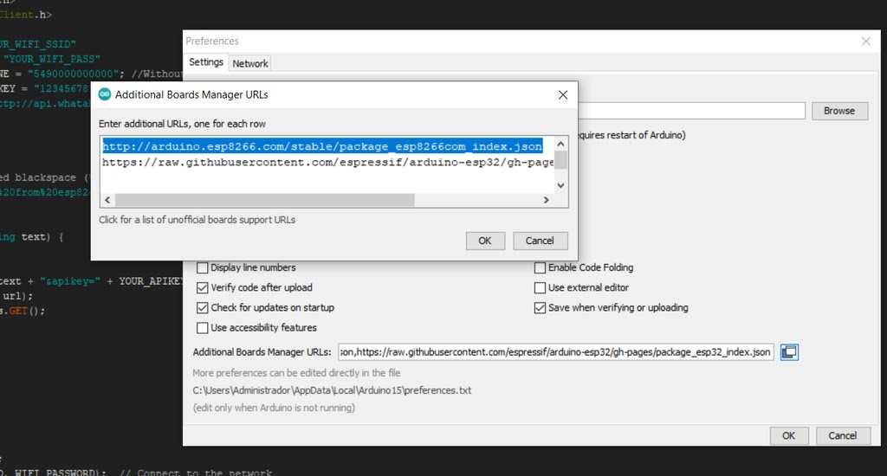
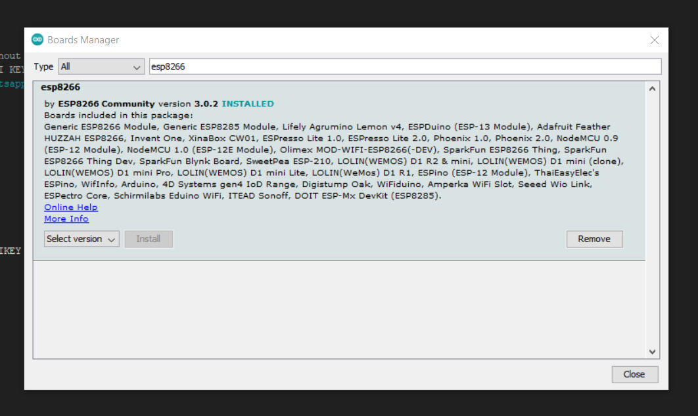
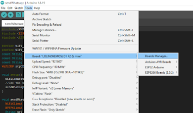
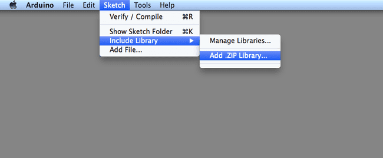
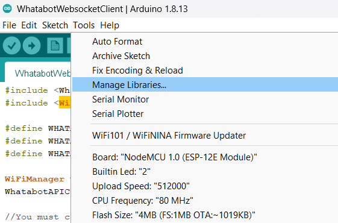
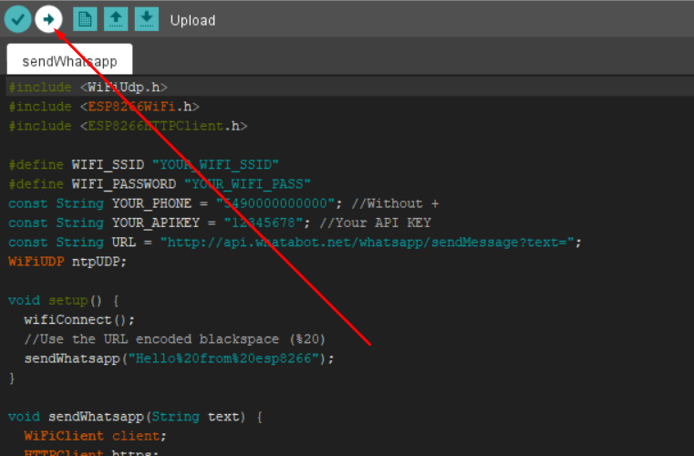

# Send and Receive WhatsApp Messages from ESP8266 - Arduino IDE - Whatabot API Realtime Client

#### A simple project showing how to send and receive WhatsApp messages from ESP8266 using [https://whatabot.io](https://whatabot.io) as a message broker

## Requirements

1. Arduino IDE installed (In this case v1.8.x)
2. ESP8266 Boards installed
3. Whatabot API Key
4. Libraries installed

## 1- Installing Arduino IDE

* Visit: [https://www.arduino.cc/en/software](https://www.arduino.cc/en/software)
* Download and install the IDE (This tutorial is based on v1.8.x Legacy IDE)

## 2- Installing ESP8266 Boards

1. Open the Arduino IDE and navigate to "File"
2. Click on "Preferences"
3. In the "Additional Boards Manager URLs" field, add the following URL: http://arduino.esp8266.com/stable/package\_esp8266com\_index
4. Download the ESP8266 Boards
   * Go to "Tools" > "Board" > "Boards Manager" in the Arduino IDE.
   * Search for "esp8266" and click on "Install."
   * Select the board you have (In this case we choose "LOLIN(WEMOS) D1 R2 & mini"):

## 3- Getting Whatabot API key

1. Visit [https://whatabot.io/get-started](https://whatabot.io/get-started)
2. Follow the steps indicated on the websitellow the steps
3. Copy your API key. **Do not share it or embed in code the public can view**
4. Paste it in the WHATABOT_API_KEY variable in main.py

## 4- Installing required libraries

1. Installing Whatabot API Library

   * Download the soruce code.zip from [https://github.com/WhatabotAPI/WhatabotAPIClient/releases/tag/1.0](https://github.com/WhatabotAPI/WhatabotAPIClient/releases/tag/1.0)
   * Add the .ZIP library:
     https://docs.arduino.cc/software/ide-v1/tutorials/installing-libraries/#importing-a-zip-library
2. Install the WiFi Manager Library

   * Go to: Tools/Manage Libraries
   * Search for the library named WiFiManager (by tzapu)
   * Install
3. Install ArduinoJson Library

   * Go to: Tools/Manage Libraries
   * Search for the library named ArduinoJson (by Benoit)
   * Install it

## 5- Replacing the variables with your data

* Variables needed:

  1. WHATABOT\_CHAT\_ID = "YOUR\_PHONE\_NUMBER"; //Without +
  2. WHATABOT\_API\_KEY = "YOUR\_WHATABOT\_API\_KEY";
* Example:

  1. WHATABOT_CHAT_ID = "5490000000000";
  2. WHATABOT_API_KEY = "38rhjd-123d-432d"

## 6- Uploading the code

**Note that the first time you execute this, the library WiFiManager will generate a wifi network called "WhatabotAPI"**

* You have to connect to it with your mobile or pc (Password: whatabotapi)
* With the web browser, enter to 192.168.4.1
* Press the button "Configure WiFi"
* Follow the steps to connect the arduino to your router

## Your board is not being recognized?

If you have a CH340G based board, follow the instructions posted here:

[https://www.instructables.com/Instalar-driver-para-CH340G/](https://www.instructables.com/Instalar-driver-para-CH340G/)
